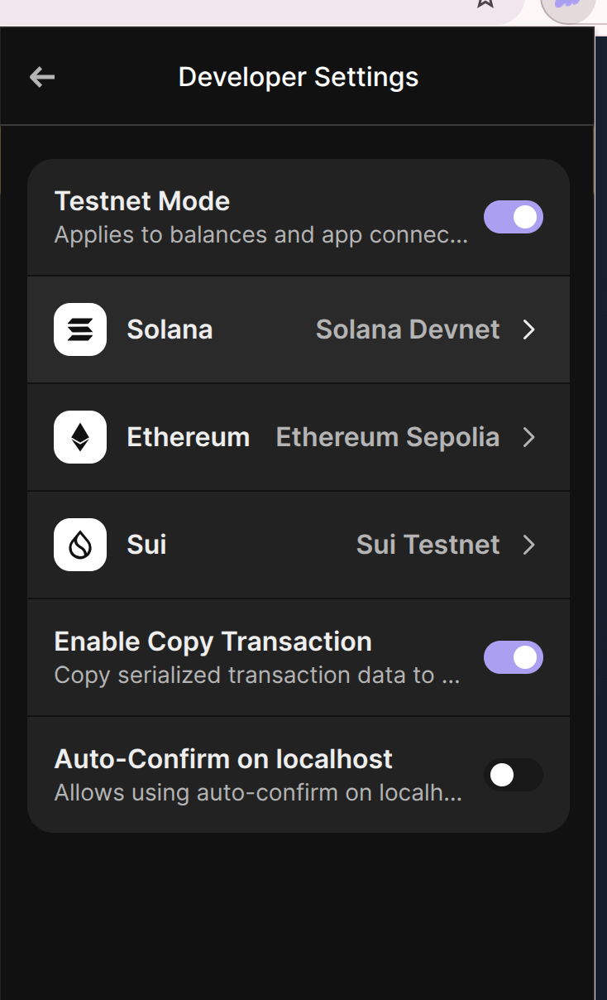
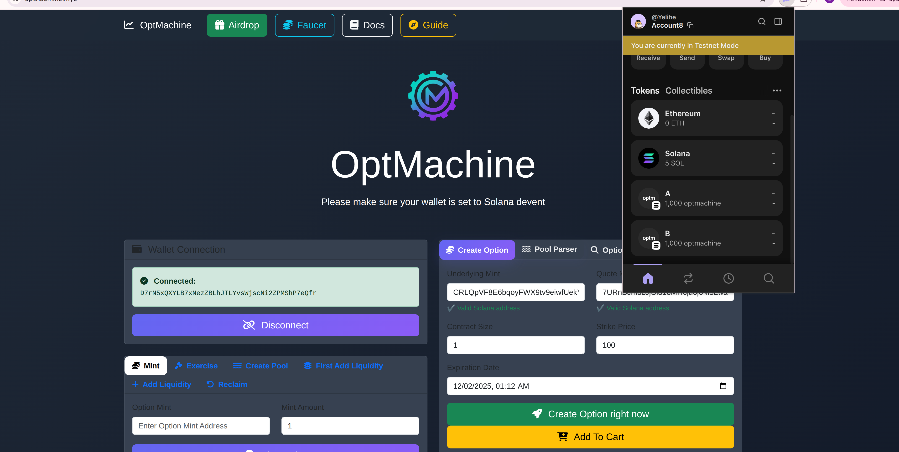
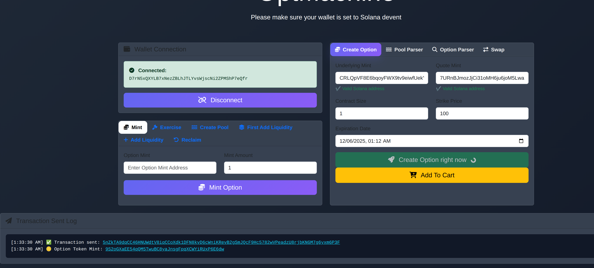
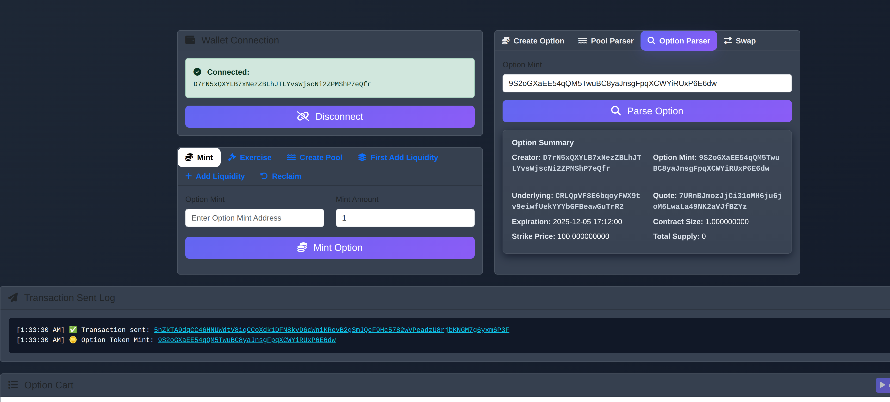
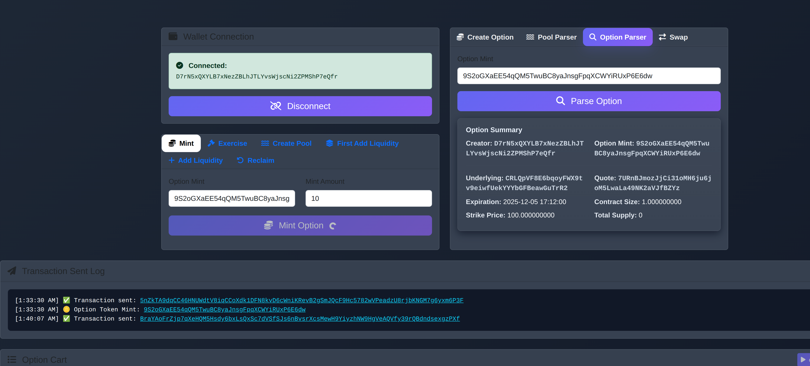
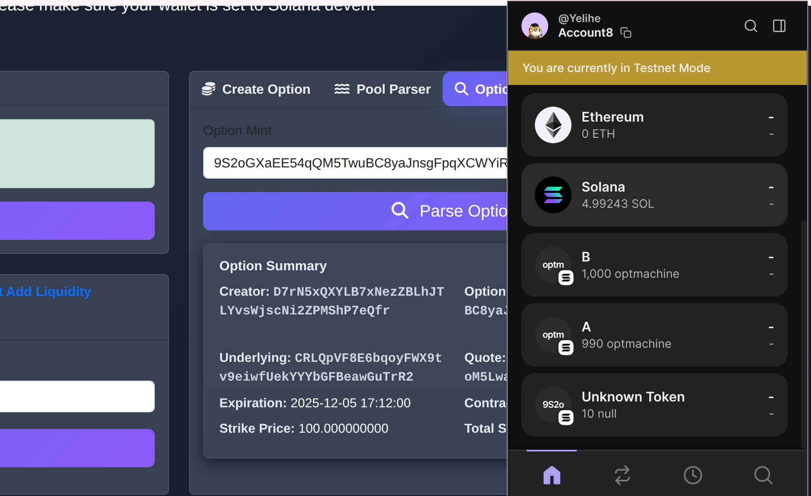
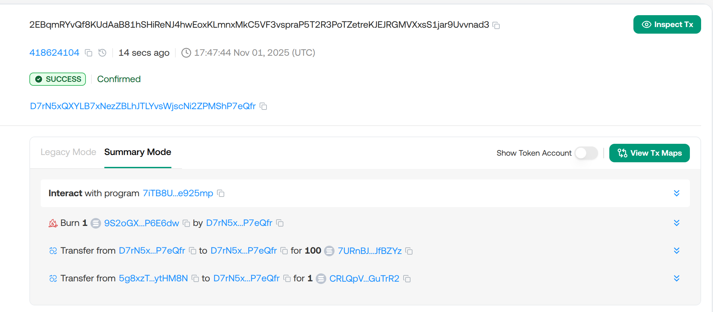
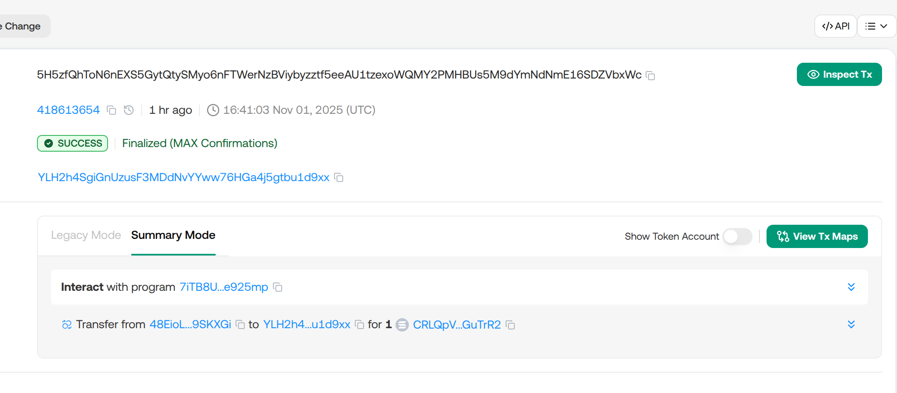

# OptMachine user guide
Welcome to be the user of this dapp I will show you how to use it step by step

## 0. Requirements
- A Solana wallet (Phantom)
- Small amount of **DEVNET SOL** for fees
- You can click the faucet button to visit solana faucet to 
get some devnet sol 
- SET THE WALLET IN TESTNET MODE

  

## 1. Connect wallet and get test tokens
- First, click the connect wallet button to connect your wallet to the website
- Then, click the airdrop button to get test tokens. We will provide you 1000 token A and 1000 token B
  

  

## 2. Create & Mint your first option
- You should create your option before you mint it
- You can set any parameter to your option, but make sure your expiration is set after your time or the option will not be created
- Also, we recommend you to set it in an appropriate size so that you can mint
- You can see the option mint on transaction logs

  

-  Copy the option mint and paste it on the option parser, you can see the detail of the option token
  

  

- Now you can mint your option 
- As you mint your option your underlying asset will be transfered to the vault if users exercise option the vault will send 
- underlying asset to the exerciser and the creator will receive the quote tokens
  

  

-You will find option tokens in your wallet 
  

  

## 3. Exercise option
- First of all, check the option token in our option parser
- Then, paste the option token mint into exercise option and choose the amount of options you'd like to exercise
- After you exercise the option token will be burned and underlying of the option will be sent to you from the vault
- Your quote token will be transfered to the creator of the option 
  

  

## 4. Reclaim assets
- After the option expires creator of the option can reclaim the collateral in the vault
    

  

